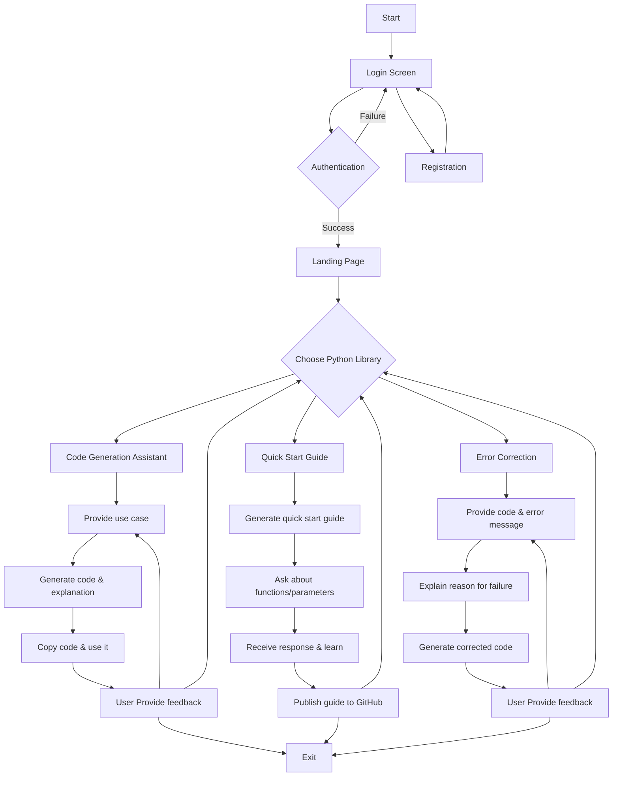

# Open-Source Python Library Coding Agent  

## Overview  
This project simplifies the multi-step process of working with Python libraries by leveraging LLM-powered agents. It integrates key functionalities like code generation, API references, error handling, and web search to provide a seamless, natural language-based interface for developers and learners.  

## Project Resources


### Links to the project resources:
- **Google Codelab**: [Codelab Link](https://codelabs-preview.appspot.com/?file_id=1cqfyDQM7pk3ZdG-ojvqj4_wscrx7qn1oA3dZL50mL0I#0)
- **Streamlit App** (Deployed on AWS EC2): [Streamlit Link](http://75.101.133.31:8501/)
- **Airflow** (Deployed on AWS EC2): [Airflow Link](http://75.101.133.31:8080/)
- **YouTube Demo**: [Demo Link](https://www.youtube.com/watch?v=mSMXuX_7uGw)

---

## Key Features

Unlock powerful capabilities that streamline your development process with intelligent repository management and interactive learning experiences.

- **Smart Repository Integration**: Upload and access any Python library instantly.
- **Interactive Learning**: Custom installation guides and tutorials.
- **Code Generation & API Mastery**: Ready-to-use code snippets.
- **Error Resolution**: Expert solutions and references.

---

# Tools and Technologies Used


# Architecture Diagram


## Proposal and Documentation  
For detailed information about the project's scope, objectives, and architecture, refer to the project proposal on **Google Codelab**: [Project Proposal Link](https://codelabs-preview.appspot.com/?file_id=1cqfyDQM7pk3ZdG-ojvqj4_wscrx7qn1oA3dZL50mL0I#0)


## User Flow




## Repository Structure

The following is the structure of the repository:
```
.
├── Dockerfile
├── README.md
├── airflow
│   ├── Dockerfile
│   ├── __init__.py
│   ├── dags
│   │   ├── data_load
│   │   │   ├── configuration
│   │   │   │   └── parameter_config.py
│   │   │   ├── process_documentation_pages
│   │   │   │   ├── load_into_pinecone.py
│   │   │   │   ├── process_docs.py
│   │   │   │   ├── scrape_url.py
│   │   │   │   └── utils
│   │   │   │       └── helper_functions.py
│   │   │   └── process_github_repo
│   │   │       ├── extract_code.py
│   │   │       ├── load_ipynb_details_to_snowflake.py
│   │   │       ├── load_md_details_to_snowflake.py
│   │   │       ├── load_py_details_to_snowflake.py
│   │   │       ├── process_ipynb_file.py
│   │   │       ├── process_md_file.py
│   │   │       ├── process_py_file.py
│   │   │       ├── processors
│   │   │       │   ├── markdown_processor.py
│   │   │       │   ├── notebook_processor.py
│   │   │       │   └── python_processor.py
│   │   │       ├── repo_clone.py
│   │   │       └── snowflake_loaders
│   │   │           ├── db_connection.py
│   │   │           └── snowflake_data_loader.py
│   │   ├── pipeline_dag_load_documentation.py
│   │   └── pipeline_dag_load_github_repo.py
│   ├── entrypoint.sh
│   ├── poetry.lock
│   ├── pyproject.toml
│   └── requirements.txt
├── fastapi_backend
│   ├── fast_api
│   │   ├── config
│   │   │   └── db_connection.py
│   │   ├── fast_api.py
│   │   ├── routes
│   │   │   ├── agent_routes.py
│   │   │   ├── github_routes.py
│   │   │   └── user_routes.py
│   │   ├── schema
│   │   │   └── request_schema.py
│   │   └── services
│   │       ├── auth_service.py
│   │       ├── github_service.py
│   │       └── user_service.py
│   └── langgraph_graphs
│       ├── constants.py
│       ├── langgraph_agents
│       │   ├── code_generation_graph
│       │   │   ├── __init__.py
│       │   │   ├── graph.py
│       │   │   └── state.py
│       │   ├── code_retrieval_graph
│       │   │   ├── configuration.py
│       │   │   ├── graph.py
│       │   │   ├── prompts.py
│       │   │   ├── researcher_graph
│       │   │   │   ├── __init__.py
│       │   │   │   ├── configuration.py
│       │   │   │   ├── graph.py
│       │   │   │   └── state.py
│       │   │   └── state.py
│       │   ├── configuration.py
│       │   ├── error_handling_graph
│       │   │   ├── graph.py
│       │   │   └── state.py
│       │   └── utils.py
│       └── retrieval.py
├── logging_module
│   ├── __init__.py
│   └── logging_config.py
├── poetry.lock
├── pyproject.toml
├── repo_structure.txt
└── streamlit_frontend
    ├── auth
    │   ├── Login.py
    │   ├── Logout.py
    │   └── register.py
    ├── features
    │   ├── code_generation_page.py
    │   ├── error_handling_page.py
    │   ├── github_credentials_page.py
    │   └── how_to_guide_page.py
    ├── streamlit_app.py
    └── utils
        ├── api_helpers.py
        ├── app_launcher.py
        ├── chat_helpers.py
        ├── chunk_processors.py
        ├── github_credentials_updater.py
        └── validate_fields.py
```


## **How to run in your machine**

Follow the steps below to clone the repository and set up the application components.

### **Clone the Repository**
```bash
git clone <repository_url>
cd <repository_directory>
```

## Commands for Setting up Airflow

```bash
### Navigate to the Airflow directory
cd airflow

### Create a `.env` file
OPENAI_API_KEY='sk-proj-******'

### Build the Docker image
docker build -t ramkumarrp16077/airflow-open-source:latest .

### Run the Docker container
docker run -d -p 8080:8080 ramkumarrp16077/airflow-open-source:latest
```
### Access Airflow
http://localhost:8080

---

## Commands for Setting up Streamlit & FastAPI

### Navigate to the project root directory
cd ..

### Create a `.env` file
OPENAI_API_KEY='sk-proj-******'
```bash
### Build the Docker image
docker build -t ramkumarrp16077/open-source-python:latest .

### Run the Docker container
docker run -d -p 8501:8501 -p 8000:8000 ramkumarrp16077/open-source-python:latest
```
### Access the applications
- **Streamlit:** http://localhost:8501
- **FastAPI (Swagger Documentation):** http://localhost:8000/docs


## Contributors


The contributions from the team members are detailed below:

| Name                         | Contribution                                                                                  |
|------------------------------|----------------------------------------------------------------------------------------------|
| **Pragnesh Anekal**          | 33% - Github Data Parsing, Front end Streamlit, FastAPI, Langgraph Setup, Code Retreival Agent, Code Generation Agent |
| **Ram Kumar Ramasamy Pandiaraj** | 33% - Scraping Documentation, Airflow, Setting up snowflake, Code Generation Agent, Github POC, Tavilly POC, Deployment , Dockerization             |
| **Dipen Manoj Patel**        | 33% - Streamlit Frontend, Web Search Agent using SerpAPI,  Github MD Parsing, GitHub Push, CI/CD Pipelines   |

---

## Attestation

We attest that we haven’t used any other students' work in our assignment and abide by the policies listed in the student handbook.

