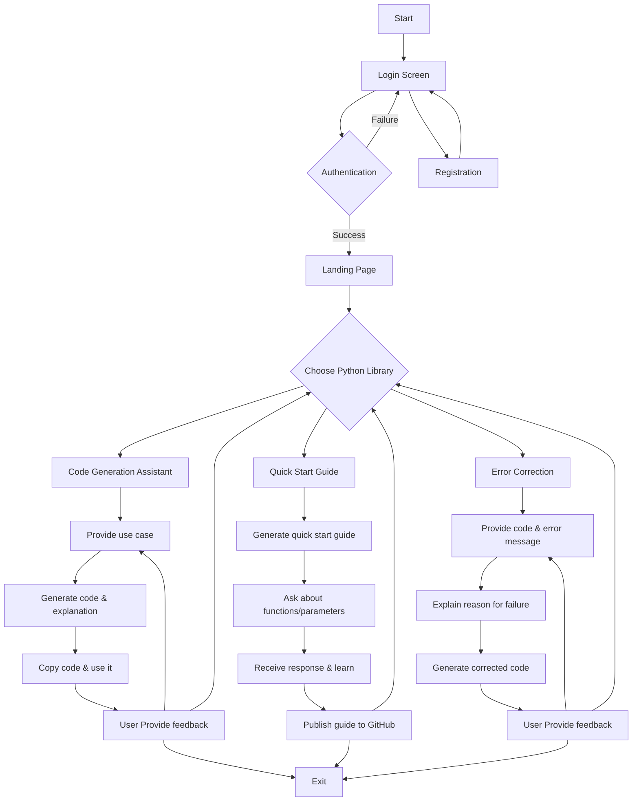

# Open-Source Python Library Coding Agent  

## Overview  
This project simplifies the multi-step process of working with Python libraries by leveraging LLM-powered agents. It integrates key functionalities like code generation, API references, error handling, and web search to provide a seamless, natural language-based interface for developers and learners.  

## Proposal and Documentation  
For detailed information about the project's scope, objectives, and architecture, refer to the project proposal on **Google Codelab**: [Project Proposal Link](https://codelabs-preview.appspot.com/?file_id=1cqfyDQM7pk3ZdG-ojvqj4_wscrx7qn1oA3dZL50mL0I#0)

## User Flow

